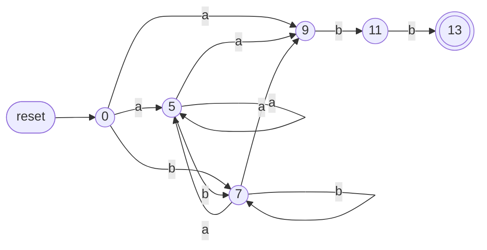
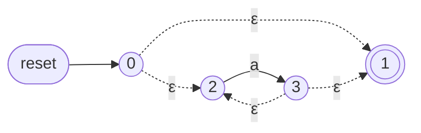
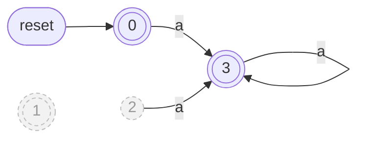
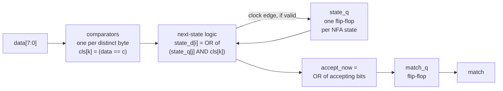
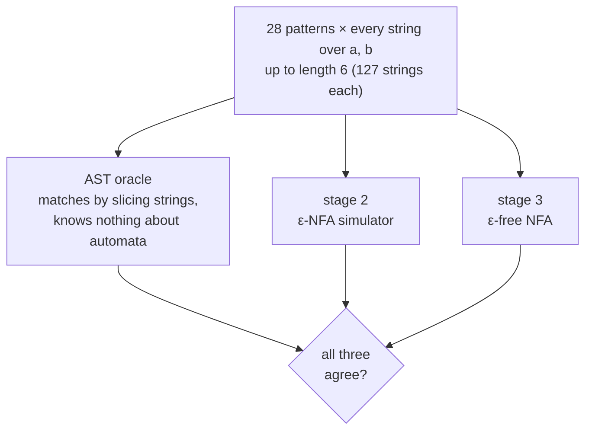

# StreamWeave

A compiler that turns a regular expression into a hardware pattern detector. You give it a regex, it gives you a synthesisable SystemVerilog module that reads **one byte per clock cycle** and raises `match` whenever the pattern turns up in the stream. The compiler is plain Python (standard library only) and the target is an Intel MAX 10 FPGA on a Terasic DE10-Lite.

<p>
  
  
  
  
</p>

```bash
python -m streamweave.codegen '(a|b)*abb' -o rtl/generated/pattern.sv
```

> [!NOTE]
> **Where it's at (October 2026):** all four compiler stages work and are tested in Python. The SystemVerilog they produce has **not** been simulated yet. That's stage 5 (cocotb + Verilator) and it's what I'm working on now. Nothing has been through Quartus or onto the board either, so there are no Fmax or logic-element numbers in this README. That's on purpose, they go in once I've actually measured them.

## Contents

- [What it does, and why](#what-it-does-and-why)
- [Quick start](#quick-start)
- [NFAs, and how one becomes hardware](#nfas-and-how-one-becomes-hardware)
- [Why an NFA and not a DFA?](#why-an-nfa-and-not-a-dfa)
- [How it works](#how-it-works)
  - [Stage 1: tokeniser and parser](#stage-1-tokeniser-and-parser)
  - [Stage 2: Thompson's construction](#stage-2-thompsons-construction)
  - [Stage 3: ε-closures and ε-elimination](#stage-3-epsilon-closures)
  - [Stage 4: code generation](#stage-4-code-generation)
- [Testing](#testing)
- [Things that caught me out](#things-that-caught-me-out)
- [Limitations](#limitations)
- [Roadmap](#roadmap)
- [Repo layout](#repo-layout)
- [References](#references)

---

## What it does, and why

Matching a regex in software is a loop: read a byte, work out which parts of the pattern you could be in the middle of, read the next byte. A more complicated pattern means more work per byte.

Hardware doesn't have to loop. Every "place you could be in the pattern" (an NFA state) gets its own flip-flop, and all of them update in parallel on the same clock edge. So the detector takes one byte per clock no matter how complicated the pattern is. A harder pattern costs more *area*, not more *time*. The idea comes from Sidhu and Prasanna (2001), and variations of it get used for things like scanning network traffic at line rate.

I built this because I wanted one project that made me do both halves properly: the compiler and automata theory side, and real RTL that has to simulate, synthesise and meet timing. It's an independent project I started in summer 2026, between first and second year of EIE at Imperial. It isn't coursework.

---

## Quick start

```bash
git clone https://github.com/⟨your-username⟩/streamweave.git
cd streamweave
python3.12 -m venv .venv
source .venv/bin/activate
pip install pytest        # only needed for the tests, the compiler itself is stdlib only
pytest tests/
```

Every stage has its own CLI, so you can watch a pattern go through the pipeline one step at a time. I use `(a|b)*abb` as the example everywhere (any string of a's and b's that ends in `abb`):

```bash
python -m streamweave.tokenizer '(a|b)*abb'         # stage 1a: tokens
python -m streamweave.parser    '(a|b)*abb'         # stage 1b: syntax tree
python -m streamweave.thompson  '(a|b)*abb' aabb    # stage 2: ε-NFA, then runs it on "aabb"
python -m streamweave.epsilon   '(a|b)*abb'         # stage 3: ε-free NFA
python -m streamweave.codegen   '(a|b)*abb'         # stage 4: SystemVerilog to stdout
```

Code generation options:

```bash
python -m streamweave.codegen '(a|b)*abb' -o rtl/generated/pattern.sv   # write to a file
python -m streamweave.codegen '(a|b)*abb' --prune       # drop unreachable states (14 -> 6 flip-flops here)
python -m streamweave.codegen '(a|b)*abb' --anchored    # only match from byte 0 (for verification)
python -m streamweave.codegen '(a|b)*abb' -m my_matcher # custom module name
```

The SystemVerilog goes to stdout (or the `-o` file) and a one-line resource summary goes to stderr, so you still see the summary when you redirect the output.

I develop in WSL2 (Ubuntu 24.04) with Python 3.12. The Python side should work on any OS with 3.12 but I haven't tried macOS. For stage 5 you'll also need Verilator and cocotb (I built Verilator from source).

---

## NFAs, and how one becomes hardware

A **finite automaton** is a fixed number of *states* joined up by *edges*, and each edge has a byte on it. You begin in the start state, and every byte you read moves you along an edge labelled with that byte. If you're sitting in an accept state when the input runs out, the input matched. The "finite" bit matters more than it sounds: the number of states is fixed when the machine is built, which is exactly what hardware needs, because the number of flip-flops is fixed at synthesis.

The **N** in NFA stands for *nondeterministic*. That sounds mysterious but it just means **the machine can be in several states at once**. If two edges leaving a state have the same byte on them, you take both. Nothing guesses and nothing backtracks, you just carry every possibility forward and see which ones survive.

This is the NFA StreamWeave ends up with for `(a|b)*abb`, after stage 3 and `--prune` (so these six are the only states that can ever turn on):



Roughly, each state means:

| State | Means |
|---|---|
| 0 | start |
| 5 | just read an `a` while looping inside `(a\|b)*` |
| 7 | just read a `b` while looping inside `(a\|b)*` |
| 9 | that `a` might have been the start of `abb` |
| 11 | seen `ab` |
| 13 | seen `abb`, so accept (double circle) |

On an `a` the machine goes to **both** 5 and 9. It doesn't know yet whether that `a` was part of the loop or the start of `abb`, and it doesn't need to know.

### Awkward in software, free in hardware

In software, "several states at once" means keeping a set of live states and looping over all of them for every byte. That's O(*n* × *m*) for *n* bytes and *m* states.

In hardware you give **every state its own flip-flop**. Bit *i* is 1 when state *i* is live, and on each clock edge every flip-flop works out its next value at the same time, from the current byte and the bits that feed into it. This is the approach from Sidhu and Prasanna (2001). It usually gets called "one-hot", even though in an NFA several bits can be hot at the same time. The loop over states disappears, because the states are separate little circuits running side by side. Time turns into area.

Here's the hardware for `(a|b)*abb` running on the input `aabb` in streaming mode (start state held on every cycle, so a match can begin at any byte):

| Clock | Byte in | 0 | 5 | 7 | 9 | 11 | 13 | Live states |
|---|---|:-:|:-:|:-:|:-:|:-:|:-:|---|
| reset | – | 1 | 0 | 0 | 0 | 0 | 0 | {0} |
| 1 | `a` | 1 | **1** | 0 | **1** | 0 | 0 | {0, 5, 9} |
| 2 | `a` | 1 | **1** | 0 | **1** | 0 | 0 | {0, 5, 9} |
| 3 | `b` | 1 | 0 | **1** | 0 | **1** | 0 | {0, 7, 11} |
| 4 | `b` | 1 | 0 | **1** | 0 | 0 | **1** | {0, 7, 13}, accept |

`match` goes high on clock 5, one cycle later, because the output is registered. The whole thing is 6 flip-flops, and it does exactly the same amount of work per byte whether one state is live or all six are.

---

## Why an NFA and not a DFA?

The textbook way to make a regex fast in *software* is to turn the NFA into a DFA using subset construction. A DFA is only ever in one state, so each byte is a single table lookup. There's no DFA anywhere in this project, and that was deliberate. These are the reasons, roughly in order of how much they matter.

### 1. No state explosion

Subset construction can blow up exponentially, because each DFA state stands for a whole *set* of NFA states. The classic example is "the *n*-th byte from the end is an `a`", i.e. `(a|b)*a` followed by *n*−1 copies of `(a|b)`. The NFA grows linearly with *n*, but the smallest possible DFA has 2<sup>*n*</sup> states, because it has to remember the last *n* bytes:

| *n* | NFA states (as built) | with `--prune` | smallest DFA (over `{a, b}`) |
|---|---|---|---|
| 3 | 22 | 8 | 8 |
| 10 | 64 | 22 | 1,024 |
| 20 | 124 | 42 | 1,048,576 |

For small *n* the DFA is no worse (at *n* = 3 they're equal after pruning), so this isn't free. But one grows linearly and the other doubles every time *n* goes up by one.

A fair objection is that a 1,024-state DFA only needs 10 flip-flops if you store the state in binary. True, but then the size just moves somewhere else:

- **into the next-state logic**, because every next-state bit becomes a function of all 10 state bits plus the 8 data bits, or
- **into block RAM**, if you store the transition table instead. For *n* = 20, even keeping only three columns (`a`, `b`, anything else), that's about a million states × 3 × 20 bits ≈ 63 Mbit. The MAX 10 on the DE10-Lite has 1,638 Kbit of M9K block RAM in total.

### 2. The clock speed should stay steadier as patterns grow

Each flip-flop's input is: compare the byte, AND it with a state bit, then OR together all the edges coming into this state. So the longest path depends on the **largest number of edges coming into any one state** (its fan-in), not on how many states there are in total. Making the pattern longer adds more small circuits side by side. It doesn't make any single one of them deeper.

In a binary-encoded DFA it's the opposite: every next-state bit depends on every state bit, so the logic gets wider and deeper as the DFA grows.

This is also one more reason ε-edges have to go (see [stage 3](#stage-3-epsilon-closures)). If they were left in as wires, a chain of them would be a long combinational path, and the clock speed would depend on the longest chain in the pattern. With them gone, every path is the same short shape: register → comparator → AND/OR → register.

> [!IMPORTANT]
> This is what I **expect**, not something I've measured yet. Fan-in depends on the pattern, so a pattern that funnels lots of edges into one state will be slower, and bigger designs also lose speed to routing. The plan is to push a set of patterns of increasing size through Quartus and plot Fmax against state count. If the line isn't roughly flat, this section gets rewritten.

### 3. You know the size before you build anything

```
NFA states = 2 × (AST nodes that aren't Concat)
```

The parser prints this before an NFA or a single line of SystemVerilog exists. With a DFA you don't find out how big it is until you've run subset construction, which is the exact step that might blow up.

### 4. The compiler can't blow up either

Thompson's construction is linear in the size of the regex, and ε-elimination is polynomial (one ε-closure per state). Subset construction can take exponential *time* as well as space. Nothing in StreamWeave's compiler is exponential, for any pattern.

### 5. One flip-flop is one place in the regex

Every bit corresponds to a position in the pattern, and the state numbers stay the same from stage 2 all the way to the RTL. When `state_q[9]` goes high in GTKWave, I know it means "maybe the start of `abb`". A DFA state is a whole set of NFA states squashed into one number, which is much harder to read off a waveform.

### 6. Patterns add up instead of multiplying

Two NFAs side by side cost the *sum* of their flip-flops. Merging two DFAs into one machine that runs both patterns (the product construction) can need up to the *product* of their state counts. That matters if this ever runs several patterns at once, which is the obvious next step for a detector like this.

### 7. It suits the FPGA

Every logic element in the MAX 10 is a 4-input LUT with its own flip-flop next to it. A design that uses lots of flip-flops with shallow logic between them is using the fabric the way it's built to be used. That's also why one-hot encoding is a common choice for ordinary state machines on FPGAs.

### What it costs

It isn't all one-way, and I'd rather say so here than have someone point it out:

| | One-hot NFA (this project) | DFA |
|---|---|---|
| Simple patterns | more flip-flops | fewer |
| Nasty patterns | grows linearly | can grow exponentially |
| Changing the pattern | regenerate the RTL and re-run Quartus | if the table is in RAM, just reload the table |
| What sets the clock speed | max fan-in (expected, not measured yet) | next-state logic, or the RAM lookup |
| In software | slow, O(*n* × *m*) | fast, O(*n*) |

The one that actually hurts is the third row. The pattern is baked into the logic, so a new pattern means a full Quartus run instead of a memory write. For a fixed detector that's fine. For something you'd want to reprogram on the fly, it's a real downside.

---

## How it works

```mermaid
flowchart LR
    A["regex text<br/>(a|b)*abb"] -->|"1a. tokenizer.py"| B["tokens"]
    B -->|"1b. parser.py"| C["syntax tree"]
    C -->|"2. thompson.py"| D["ε-NFA"]
    D -->|"3. epsilon.py"| E["ε-free NFA"]
    E -->|"4. codegen.py"| F["SystemVerilog"]
    F -->|"5. cocotb + Verilator"| G["verified RTL"]
    G -->|"Quartus"| H["DE10-Lite"]

    classDef done fill:#d8f3dc,stroke:#2d6a4f,color:#000
    classDef todo fill:#f2f2f2,stroke:#999,stroke-dasharray:4 3,color:#555
    class A,B,C,D,E,F done
    class G,H todo
```



<sub>Green = working and tested in Python. Grey dashed = not done yet.</sub>

| Stage | File | In → out | Full walkthrough |
|---|---|---|---|
| 1a | `tokenizer.py` | text → tokens | [docs/frontend_walkthrough.md](docs/frontend_walkthrough.md) |
| 1b | `parser.py` | tokens → syntax tree (AST) | same as above |
| 2 | `thompson.py` | AST → ε-NFA | [docs/thompson_walkthrough.md](docs/thompson_walkthrough.md) |
| 3 | `epsilon.py` | ε-NFA → ε-free NFA | [docs/epsilon_walkthrough.md](docs/epsilon_walkthrough.md) |
| 4 | `codegen.py` | ε-free NFA → SystemVerilog | [docs/codegen.md](docs/codegen.md) |

Each walkthrough in `docs/` has a full trace of `(a|b)*abb` through that stage. This README is the short version. Here's what the example looks like after each stage:

| After | You've got | Size |
|---|---|---|
| Stage 1 | syntax tree | 10 nodes, 3 of them `Concat` |
| Stage 2 | ε-NFA | 14 states, 5 symbol edges, 11 ε-edges |
| Stage 3 | ε-free NFA | 14 states, 22 symbol edges, 0 ε-edges (8 states now unreachable) |
| Stage 4 | SystemVerilog | 14 flip-flops and 2 byte comparators, or 6 flip-flops with `--prune` |

### Stage 1: tokeniser and parser

The language is deliberately just the classic Thompson core: literals, concatenation, `|`, `*` and brackets. That's enough to describe any regular language, and it's exactly the set of things Thompson's construction has a rule for.

The tokeniser turns text into a flat list of tokens and decodes escapes on the way, so `\*` arrives at the parser as one literal byte (42) and can't be mistaken for a star. Every symbol is a byte, 0 to 255, because the hardware reads one byte per clock.

The parser is recursive descent, one function per grammar rule:

```
regex          :=  alternation EOF
alternation    :=  concatenation ( '|' concatenation )*
concatenation  :=  repetition+
repetition     :=  atom '*'*
atom           :=  CHAR | '(' alternation ')'
```

There's no precedence table anywhere in the code. Precedence falls out of the order the functions call each other: `parse_repetition` is called last, so it grabs its operand first, which is why `*` binds tighter than concatenation, and concatenation binds tighter than `|`. Took me a while to get my head round that one but it's quite neat once it clicks.

```
$ python -m streamweave.parser '(a|b)*abb'
Concat
├── Concat
│   ├── Concat
│   │   ├── Star
│   │   │   └── Alt
│   │   │       ├── Char 'a'
│   │   │       └── Char 'b'
│   │   └── Char 'a'
│   └── Char 'b'
└── Char 'b'
nodes: 10
estimated NFA states: 14
```

(The tree leans left because `abc` parses as `(ab)c`. It looks lopsided, but concatenation is associative and costs nothing in hardware, so it doesn't matter.)

Errors point at the actual problem instead of just saying "syntax error":

```
$ python -m streamweave.parser '(a'
unclosed '(' at position 0
  (a
  ^

$ python -m streamweave.parser 'a+'
the '+' operator is not supported in v1 (write XX* instead of X+) at position 1
  a+
   ^
```

<details>
<summary><b>Supported syntax</b></summary>

| You write | It means |
|---|---|
| `a`, `7`, `-` | that literal byte |
| `ab` | `a` then `b` |
| `a\|b` | `a` or `b` |
| `a*` | zero or more `a` |
| `( … )` | grouping |
| `\n` `\t` `\r` `\f` `\v` `\0` | control bytes |
| `\*` `\|` `\(` `\+` `\.` … | the literal character (works for every metacharacter, including ones v1 doesn't support, so every byte is still writable) |
| `\x41` | any byte by its hex value |

Rejected with an error that names the feature: `+ ? . [ { ^ $` and the shorthands `\d \w \s`. Anything above U+00FF is rejected because it doesn't fit in a byte.

</details>

### Stage 2: Thompson's construction

This turns the tree into an ε-NFA with one rule per node type. Every fragment it builds has exactly one entry state and one exit state, so each rule can treat its children as black boxes and never needs to look inside them:

```
Char c        s --c--> a                          2 states, 1 symbol edge

Concat L R    [ L ] --ε--> [ R ]                  0 states, 1 ε-edge

Alt L R             ┌--ε--> [ L ] --ε--┐          2 states, 4 ε-edges
              s ----┤                  ├----> a
                    └--ε--> [ R ] --ε--┘

Star B              ┌─────────── ε ───────────┐   2 states, 4 ε-edges
                    │                         v   (top edge: skip, so it matches "")
              s ----┴--ε--> [ B ] --ε-------> a
                              ^      │
                              └──ε───┘            (bottom edge: go round again)
```

Because only `Concat` is free, you know the exact state count before building anything:

```
NFA states = 2 × (number of AST nodes that aren't Concat)
```

For `(a|b)*abb` that's 2 × 7 = 14. The parser prints this as its estimate, and a test checks that Thompson really does allocate that many states. If the two ever disagree, the test fails now instead of showing up as a strange flip-flop count in Quartus three stages later.

<a name="stage-3-epsilon-closures"></a>

### Stage 3: ε-closures and ε-elimination

Stage 2 deliberately builds a machine full of ε-edges, and stage 3 deliberately removes every one of them. That looks like wasted effort, so here's why both halves are needed.

**Why stage 2 wants them.** ε-edges let each Thompson rule glue fragments together without looking inside them. Without them, `Alt` would have to reach into both children and merge their start states, which means knowing how the children were built. Build it correctly first, optimise second.

**Why the hardware can't have them.** An ε-edge means "move without reading a byte". In a design that reads one byte per clock, that means "move without a clock edge", and the only way to build that is a plain wire from one state's logic into another's within the same cycle. That causes two problems:

- Around a `*` loop the wires feed back into themselves, which is a **combinational loop**. Verilator refuses to simulate it (`UNOPTFLAT`) and Quartus can't do timing analysis on it.
- Even without a loop, a chain of ε-edges would be a long combinational path, so the clock speed would depend on the longest chain in the pattern.

So the ε-edges get dealt with once, at compile time, on my laptop, instead of in silicon.

#### What an ε-closure is

The ε-closure of a state is everywhere you can drift to *for free*, without reading anything:

```
closure(p) = { p } ∪ { every state reachable from p using only ε-edges }
```

Here's the ε-NFA that stage 2 builds for `a*` (dashed arrows are ε-edges, double circle is accept):



| State | closure | Why |
|---|---|---|
| 0 | {0, 1, 2} | from the start you can skip straight to the exit, or go into the body |
| 1 | {1} | the exit doesn't go anywhere |
| 2 | {2} | the body's entry has no ε-edges out |
| 3 | {1, 2, 3} | from the end of the body you can leave, or loop back round |

It's computed with a worklist and a `seen` set rather than recursion, because patterns like `(a*)*` have genuine ε-*cycles* and a naive recursive walk would never finish. Each state goes on the worklist at most once, so it always terminates.

#### The rewrite

For every state `p`: drift for free first, *then* read one byte.

```
for every symbol edge  q --c--> r  where q is in closure(p):   add the edge  p --c--> r
p is accepting  if  the old accept state is in closure(p)
```

For `a*` the only symbol edge is `2 --a--> 3`, so every state whose closure contains 2 gets its own copy of that edge:



Three things worth noticing:

- **State 0 is now accepting.** `a*` matches the empty string, and with no ε-edges left to drift along, the only way to say that is to make the start state accept.
- **`3 --a--> 3` is a self-loop, and that's fine.** It's *registered* feedback (the flip-flop feeds itself through a clock edge), which every counter ever built does. What can't be built is feedback *without* a register in the way, and that's what the ε-cycle would have been.
- **States 1 and 2 are now unreachable** (greyed out). They were only ever ε-plumbing. I keep their numbers so the numbering is the same in every stage, and `--prune` drops them.

#### Closure before the byte, not after

There are two textbook ways to do this rewrite, and the choice shows up in the hardware:

| | Closure **before** the byte (what I do) | Closure before **and after** |
|---|---|---|
| Start | one state | a *set* of states, closure(start) |
| Accept | a *set* of states | one state |
| On reset | exactly one bit is set | a multi-bit pattern has to be loaded |
| `match` logic | an OR of a few flip-flops | one flip-flop |

A wider OR gate is combinational and basically free. A multi-bit reset value is real state that has to be driven. So closure-before is the better trade for hardware.

#### Nothing is lost, it's just stored differently

After reading one `a` in `(a|b)*abb`, the ε-NFA from stage 2 is in **nine** states: {1, 2, 3, 4, 5, 6, 8, 9, 10}. The ε-free machine is only in **two**: {5, 9}. Take the closure of {5, 9} and you get the original nine back. The hardware only stores the states that actually consumed a byte, and all the free drifting is baked into the edges instead of happening at run time.

| `(a\|b)*abb` | States | Symbol edges | ε-edges |
|---|---|---|---|
| after stage 2 | 14 | 5 | 11 |
| after stage 3 | 14 | 22 | **0** |
| with `--prune` | 6 | 11 | 0 |

The edge count goes up because one ε-edge can be the shared start of lots of paths. Edges turn into AND gates, which are cheap, so that's exactly the trade the hardware wants.

This isn't subset construction, even though it uses the same closures. Subset construction turns an NFA into a DFA where each new state *is* a set of old states, which is where the 2<sup>*n*</sup> comes from. ε-elimination turns an NFA into another NFA with exactly the same states.

### Stage 4: code generation

The whole generator follows one rule:

> Every NFA state becomes a flip-flop, every edge becomes an AND gate, and each flip-flop's input is the OR of the edges pointing into it.

```
state_d[i] = OR over every edge  j --c--> i  of  ( state_q[j] AND (data == c) )
```



The generated module:

| Port | What it does |
|---|---|
| `clk` | clock |
| `rst_n` | synchronous, active-low reset (the DE10-Lite buttons read 0 when pressed). Only the start state is live afterwards |
| `valid` | there's a real byte on `data` this cycle. When it's low the state just holds |
| `data[7:0]` | the input byte |
| `match` | registered, so it goes high one cycle **after** the last byte of a match |

There are two modes, picked at generation time:

| | Streaming (default) | `--anchored` |
|---|---|---|
| Start state | forced to 1 every cycle | only live straight after reset |
| `match` after byte *i* means | some substring ending at byte *i* matches | bytes 0 to *i* match, all of them |
| Same as | the pattern with `.*` stuck on the front | `nfa.matches()` on each prefix |
| Used for | the actual detector | checking the RTL against the Python model like-for-like |

And the timing, for `ab*a` on the input `xaba` in streaming mode:

```
clk     _/~\_/~\_/~\_/~\_/~\_
data      x   a   b   a   -
valid     1   1   1   1   0
match     0   0   0   0   1    <- "aba" finished on the previous cycle's byte
```

<details>
<summary><b>What the generated SystemVerilog looks like</b></summary>

This is `generate()` run on a hand-built 3-state NFA for `ab*a`, because it fits on a screen. (The compiler's own NFA for `ab*a` has 8 states, or 4 with `--prune`.)

```systemverilog
// ==========================================================================
// Generated by StreamWeave stage 4 (codegen.py). DO NOT EDIT BY HAND.
//   pattern        : ab*a
//   mode           : streaming search
//   flip-flops     : 3   (one per NFA state)
//   AND terms      : 3   (one per symbol edge)
//   comparators    : 2   (one per distinct symbol)
//   start state    : 0  -> bit 0
//   accepting      : [2]
// --------------------------------------------------------------------------
// TIMING: `match` is registered. It asserts one clock AFTER the final byte
//         of a match is presented with `valid` high. The cocotb testbench
//         must account for that one cycle or it will report 100% mismatch.
// ==========================================================================

`default_nettype none

module pattern_match (
    input  wire        clk,
    input  wire        rst_n,   // active-low reset
    input  wire        valid,   // a byte is present on `data` this cycle
    input  wire [7:0]  data,
    output wire        match
);

    localparam int NUM_STATES = 3;
    localparam logic [2:0] START_MASK  = 3'b001;
    localparam logic [2:0] ACCEPT_MASK = 3'b100;

    // ---- one flip-flop per NFA state ---------------------------------
    logic [2:0] state_q;   // states live after the bytes seen so far
    logic [2:0] state_d;   // states live after this cycle's byte
    logic       match_q;

    // ---- symbol decode: one comparator per DISTINCT symbol -----------
    logic [1:0] cls;
    always_comb begin
        cls[0] = (data == 8'h61);   // 'a'
        cls[1] = (data == 8'h62);   // 'b'
    end

    // ---- next-state logic: ALL states evaluated in parallel ----------
    always_comb begin
        state_d = '0;              // default assignment: prevents latches
        // streaming: start held active every cycle, so a match may begin
        // at any byte offset (equivalent to a '.*' prefix)
        state_d[0] = 1'b1;
        state_d[1] = (state_q[0] & cls[0]) | (state_q[1] & cls[1]);
        state_d[2] = (state_q[1] & cls[0]);
    end

    // ---- accept detection: reduction OR over the accepting bits ------
    wire accept_now = |(state_d & ACCEPT_MASK);

    always_ff @(posedge clk) begin
        if (!rst_n) begin
            state_q <= START_MASK;   // ONE bit, because stage 3 took the
            match_q <= 1'b0;         // closure BEFORE the byte
        end else if (valid) begin
            state_q <= state_d;
            match_q <= accept_now;
        end else begin
            match_q <= 1'b0;         // no byte consumed, no match reported
        end
    end

    assign match = match_q;

endmodule

`default_nettype wire
```

</details>

A few generator choices worth pointing out (all explained properly in [docs/codegen.md](docs/codegen.md)):

- **`` `default_nettype none ``** at the top, so a typo'd signal name is a compile error instead of a silent new wire, and **`state_d = '0`** as a default assignment, so no latches.
- **One comparator per distinct byte**, shared by every edge with that label. `(a|b)*abb` has 22 edges but only needs 2 comparators.
- **Deterministic output.** Edges are sorted before emitting, so the same regex always gives a byte-identical file. That's what lets CI diff the generated RTL between commits.
- **Unreachable states are kept by default** so bit *i* is always NFA state *i* (much easier to debug in GTKWave). `--prune` removes them. Their input is constant 0 so Quartus should optimise them away anyway, but I haven't checked that yet.
- **No HDL library** (Amaranth, MyHDL etc.), just strings. Every line of the output traces back to one line of `generate()`.

---

## Testing

The tests I trust most don't check the *shape* of an automaton (state counts, edge counts), they check its *behaviour* against something that shares no code with it:



If I only compared stage 2 against stage 3, a bug that broke both in the same way would sail through. Keeping an independent oracle in the loop catches that.

I don't use Python's `re` as the reference model. It supports backreferences and lookahead, which aren't regular, so comparing against it on the wrong patterns gives "mismatches" where the hardware is actually the one that's right.

| Suite | Tests |
|---|---|
| `tests/test_tokenizer.py` | 64 |
| `tests/test_parser.py` | 139 |
| `tests/test_thompson.py` | 73 |
| `tests/test_epsilon.py` | 62 |
| `tests/test_codegen.py` | ⟨N⟩ |

Stage 5 (in progress) is the hardware version of the same idea: a cocotb testbench that drives bytes into the Verilator-simulated RTL and checks `match` against the Python model every cycle. Anchored mode first, because it's like-for-like. Then streaming, where the model has to re-enable its start state on every byte to match what the hardware does.

---

## Things that caught me out

**1. All my round-trip tests passed and the code was still wrong.** `to_pattern()` turns a syntax tree back into regex text, and the rule is `parse(to_pattern(parse(p))) == parse(p)`. Over a hundred hand-written tests passed. Then I checked it exhaustively, on every pattern up to length 8 over the alphabet `a b | * ( )` (2,015,539 inputs), and got 592 failures. For example `a(bc)` was printed back as `abc`, which parses into a differently shaped tree. The fix was keeping the brackets when the right-hand side of a `Concat` is itself a `Concat`. The sweep (up to length 6) is now part of the test suite. Lesson learned: if something can be checked exhaustively on a small domain, check it exhaustively.

**2. Equal isn't the same as identical.** AST nodes are frozen dataclasses, so the two `Char('a')` nodes in `aa` compare equal and hash the same. If Thompson's construction cached fragments by node ("I've built this one already"), `aa` would quietly turn into a 2-state machine for `a`, and nothing would crash. It would just accept the wrong strings, three stages later, on an FPGA. There's a test pinning `aa` at 4 states so that can't happen.

**3. The output is one cycle late, on purpose.** `match` comes out of a flip-flop so it never glitches and anything downstream gets a clean timing path. The cost is one cycle of latency, and a testbench that forgets about it reports a 100% mismatch rate.

**4. `a*` matches on every single cycle in streaming mode.** It matches the empty string, so the start state is accepting and `match` is high on every valid byte. Technically correct and completely useless. The generated header warns about it.

**5. Most of the flip-flops don't do anything without `--prune`.** For `(a|b)*abb`, 8 of the 14 are unreachable after stage 3. Removing them is dead-code elimination, not minimisation (there's no DFA minimisation anywhere in here). I keep them by default for debugging, but it's worth knowing they're there.

---

## Limitations

- **Not verified end to end yet.** Stage 4's output hasn't been simulated, synthesised or run on the board.
- **v1 syntax only.** No `+`, `?`, `.`, character classes, `{n,m}` or anchors. You can write `X+` as `XX*`, it just costs more states.
- **No backreferences or lookaround, ever.** They aren't regular. A machine with one bit per state has nowhere to store the text it matched.
- **Changing the pattern means re-running Quartus.** The pattern is baked into the logic, not stored in memory, so there's no reloading it at run time.
- **One pattern per module.** You can OR patterns together in one regex, but then you can't tell which one matched.
- **Bytes only.** Anything outside 0 to 255 is rejected by the tokeniser.

## Roadmap

- [x] Stage 1: tokeniser and recursive-descent parser
- [x] Stage 2: Thompson's construction
- [x] Stage 3: ε-elimination
- [x] Stage 4: SystemVerilog generation (streaming and anchored modes, `--prune`)
- [ ] Stage 5: cocotb + Verilator testbench, RTL vs Python model, anchored then streaming
- [ ] GitHub Actions running pytest and the cocotb regression on every push
- [ ] Quartus synthesis, with real Fmax and logic-element numbers for a set of patterns
- [ ] Fmax against pattern size: test whether the clock speed really stays flat ([why I expect it to](#2-the-clock-speed-should-stay-steadier-as-patterns-grow))
- [ ] Running on the DE10-Lite with a small demo wrapper
- [ ] v2 syntax: `+` and `?` as their own Thompson rules, then character classes and `.`

---

## Repo layout

```
streamweave/
├── streamweave/        the compiler (Python 3.12, standard library only)
│   ├── tokenizer.py      stage 1a  text   -> tokens
│   ├── parser.py         stage 1b  tokens -> AST
│   ├── thompson.py       stage 2   AST    -> ε-NFA
│   ├── epsilon.py        stage 3   ε-NFA  -> ε-free NFA
│   └── codegen.py        stage 4   ε-free NFA -> SystemVerilog
├── tests/              pytest suites, one per stage
├── docs/               long-form walkthroughs, one per stage
├── rtl/generated/      compiler output goes here
├── tb/                 cocotb + Verilator testbench (stage 5, in progress)
└── examples/           toolchain smoke tests from when I was learning (adder, blinky)
```

---

## References

- K. Thompson, "Regular Expression Search Algorithm", *Communications of the ACM*, 11(6), 1968.
- R. Sidhu and V. K. Prasanna, "Fast Regular Expression Matching Using FPGAs", *IEEE FCCM*, 2001. [doi:10.1109/FCCM.2001.22](https://doi.org/10.1109/FCCM.2001.22)
- The `(a|b)*abb` example is the classic one from Aho, Lam, Sethi and Ullman, *Compilers: Principles, Techniques, and Tools* (the Dragon Book).

## About

I'm Junhao Liu, a second-year Electronic and Information Engineering student at Imperial College London. If you spot something wrong, especially on the hardware side, please open an issue or message me on [LinkedIn](⟨your-linkedin-url⟩).

## License

MIT, see [LICENSE](LICENSE).
