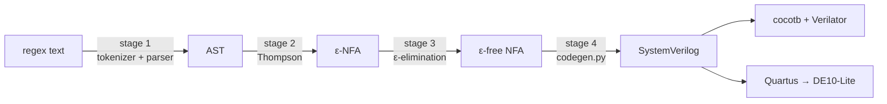

# Stage 4: Code Generation

`RegDetect/codegen.py` turns an ε-free NFA into a synthesisable SystemVerilog pattern detector. The
detector reads one byte per clock and checks every NFA state in parallel.

This page explains what the generator does, how the code does it, and **why it is built the way it
is**. The [code walkthrough](#code-walkthrough) goes through `codegen.py` function by function. The
[design decisions](#design-decisions) section explains each choice, with the alternatives I
considered and what the choice costs.

## Contents

- [Quick start](#quick-start)
- [Where this stage sits](#where-this-stage-sits)
- [How it works](#how-it-works)
- [Input contract](#input-contract)
- [The generated module](#the-generated-module)
- [Code walkthrough](#code-walkthrough)
- [Design decisions](#design-decisions)
- [Worked example: `ab*a`](#worked-example-aba)
- [Verification notes](#verification-notes)
- [Known limitations](#known-limitations)
- [References](#references)

---

## Quick start

```bash
# print the SystemVerilog to the terminal
python -m RegDetect.codegen '(a|b)*abb'

# write it into the repo
python -m RegDetect.codegen '(a|b)*abb' -o rtl/generated/pattern.sv

# options
python -m RegDetect.codegen '(a|b)*abb' --anchored     # match from byte 0 only
python -m RegDetect.codegen '(a|b)*abb' --prune        # drop unreachable states
python -m RegDetect.codegen '(a|b)*abb' -m my_matcher  # custom module name
```

The SystemVerilog goes to stdout (or the `-o` file). A one-line resource summary goes to stderr, so
redirecting the output into a file still shows the summary on screen.

From Python:

```python
from RegDetect.codegen import generate

sv = generate(nfa, module_name="pattern_match", pattern="(a|b)*abb")
```

---

## Where this stage sits



Stages 1 to 3 exist to produce a clean graph. This is the first stage that produces hardware.

---

## How it works

The whole generator follows one rule:

> **Every NFA state becomes a flip-flop, every edge becomes an AND gate, and each flip-flop's input
> is the OR of the edges pointing into it.**

An NFA can be in several states at once, so the hardware stores the set of live states as a bit
vector: bit `i` is high when state `i` is live. After each byte, a state is live if some edge leads
into it from a state that was live before, and the byte matches that edge's label:

```
state_d[i] = OR over every edge  j --x--> i  of  ( state_q[j] AND (data == x) )
```

Internally the generator runs four steps:

| Step | Function | What it does |
|---|---|---|
| 1 | `read_nfa` | Validates the stage 3 object, finds unreachable states, fixes the bit order, sorts edges |
| 2 | `collect_classes` | Gives each distinct byte label one comparator |
| 3 | `incoming_terms` | Regroups edges by **destination** state, one AND term per edge |
| 4 | `generate` | Writes the module as text |

Step 3 is the core of the stage. Stage 3 stores edges by *source* ("from state 1 on `a`, go to state
2"), because that is how you think about an automaton. Hardware has to be written by *destination*,
because you are writing one flip-flop's input at a time, and the question is "what can turn this bit
on?".

```
stored by source (stage 3)          needed by destination (stage 4)

0 --a--> 1                          into 1:  from 0 on a,  from 1 on b
1 --b--> 1              ==>         into 2:  from 1 on a
1 --a--> 2
```

---

## Input contract

`generate` expects the `EpsilonFreeNFA` produced by stage 3 (`RegDetect/epsilon.py`):

| Field | Type | Meaning |
|---|---|---|
| `state_count` | `int` | states are numbered `0 .. state_count-1` |
| `start` | `int` | exactly **one** start state |
| `accepting` | `frozenset[int]` | a **set** of accepting states |
| `symbol_edges` | iterable of `SymbolEdge(source, symbol, target)` | `symbol` is a byte, `0..255` |

The generator raises `CodegenError` if any state number is out of range, or if any epsilon edge is
still present (see [D2](#d2-refuse-epsilon-edges-instead-of-handling-them)).

---

## The generated module

```systemverilog
module pattern_match (
    input  wire        clk,
    input  wire        rst_n,   // active-low, synchronous
    input  wire        valid,   // a byte is present on `data` this cycle
    input  wire [7:0]  data,
    output wire        match    // registered: one cycle after the final byte
);
```

| Port | Meaning |
|---|---|
| `clk` | clock |
| `rst_n` | reset when 0; only the start state is live afterwards |
| `valid` | a real byte is on `data`. When low, the state holds and `match` stays low |
| `data[7:0]` | the input byte |
| `match` | a match ended on the byte presented in the **previous** cycle |

Every generated file starts with a header recording the pattern, the mode, and the flip-flop,
AND-term and comparator counts, so a file sitting in `rtl/generated/` explains itself. These counts
come from Python and show what the RTL *declares*. They are not synthesis results; those come from the
Quartus fitter report.

---

## Code walkthrough

### File layout

`codegen.py` is split into five numbered sections, and data flows through them in order:

```
codegen.py
├── CodegenError
├── 1. Reading the stage 3 object    _attr, _as_state_set, Design, reachable, read_nfa
├── 2. Symbols -> comparators        _symbol_key, symbol_expr, _show_byte, symbol_label,
│                                    collect_classes
├── 3. Edges -> next-state equations incoming_terms
├── 4. The emitter                   _mask, generate, report
└── 5. CLI                           main
```

```
nfa ──read_nfa──▶ Design ──collect_classes──▶ classes, index
                     │                              │
                     └────────incoming_terms◀───────┘
                                  │
                                  ▼
                          terms ──generate──▶ SystemVerilog text
```

Functions starting with `_` are internal helpers. The public API is `generate`, `report` and the
CLI; `read_nfa`, `reachable`, `symbol_expr`, `collect_classes` and `incoming_terms` are public too so
the tests can check each step on its own.

The file starts with `from __future__ import annotations`. This tells Python to store type hints as
text rather than evaluate them when the file loads. On Python 3.12 the hints would work without it;
it is there so the file doesn't break on an older interpreter.

---

### The error class

```python
try:
    from RegDetect.errors import RegDetectError
except ImportError:
    class RegDetectError(Exception):
        """Base class for every RegDetect compiler error."""


class CodegenError(RegDetectError):
    """The NFA cannot be turned into hardware."""
```

The idea is that every compiler error, from any stage, inherits from one base class,
`RegDetectError`. The CLI can then catch all of them with a single `except` clause and print a
clean message, while a genuine bug in the code (say, a `KeyError`) still crashes with a full
traceback. The `try/except` fallback undermines this; see [Known limitations](#known-limitations).

---

### 1. Reading the stage 3 object

#### `_attr`

```python
def _attr(obj: object, *names: str):
    for name in names:
        if hasattr(obj, name):
            return getattr(obj, name)
    raise CodegenError(...)
```

Looks up the first attribute from a list of possible names. `*names` collects any number of
arguments into a tuple, so `_attr(nfa, "state_count", "num_states")` tries `state_count`, then
`num_states`. `hasattr` and `getattr` look up an attribute by its name as a string, which is what
lets the name be a variable.

It exists so a rename in stage 3 doesn't immediately break stage 4. That is also its weakness: it
hides interface changes instead of reporting them, so it will be cut down to one name per field.

#### `_as_state_set`

```python
def _as_state_set(obj: object, label: str) -> frozenset[int]:
    if isinstance(obj, int):
        return frozenset({obj})
    try:
        return frozenset(int(x) for x in obj)
    except TypeError as exc:
        raise CodegenError(f"cannot read {label} from {obj!r}") from exc
```

Turns either a single state number or any collection of them into a `frozenset`. After this call,
the rest of the file only ever deals with one shape of data.

- `int(x) for x in obj` is a **generator expression**: it produces the values one at a time and hands
  them straight to `frozenset`, without building an intermediate list.
- If `obj` can't be looped over, Python raises `TypeError`. `raise ... from exc` re-raises it as a
  `CodegenError` while keeping the original error attached, so the traceback shows both: what went
  wrong in my terms, and what Python actually tripped on.

#### `Design`

```python
@dataclass(frozen=True)
class Design:
    state_count: int
    start: int
    accepting: frozenset[int]
    edges: tuple[tuple[int, object, int], ...]   # (source, symbol, target)
    order: tuple[int, ...]                       # NFA ids, in bit order
    bit: dict[int, int]                          # NFA id -> bit position
    dead: tuple[int, ...]                        # unreachable NFA ids

    @property
    def width(self) -> int:
        return len(self.order)
```

A `Design` holds everything the emitter needs, with every decision already made. `order` and `bit`
are two directions of the same mapping: `order[3]` is the NFA state stored in bit 3, and `bit[7]` is
the bit position of NFA state 7. Without pruning they are both the identity.

`width` is a `@property`: it is read like a field (`design.width`) but calculated each time from
`order`. Storing it as a separate field would create two values that could disagree.

One subtlety: `frozen=True` stops you reassigning `design.bit`, but the dict inside it can still be
modified. Nothing in the file does that, but "frozen" is shallow.

#### `reachable`

```python
def reachable(start: int, edges) -> frozenset[int]:
    out: dict[int, list[int]] = {}
    for src, _sym, dst in edges:
        out.setdefault(src, []).append(dst)
    seen = {start}
    work = [start]
    while work:
        s = work.pop()
        for d in out.get(s, ()):
            if d not in seen:
                seen.add(d)
                work.append(d)
    return frozenset(seen)
```

Finds every state that can be reached from the start state. Two parts:

1. **Build an adjacency map**: for each state, the list of states its edges lead to.
   `out.setdefault(src, [])` returns the list for `src`, creating an empty one first if there isn't
   one yet. It replaces the usual "if key not in dict, add it" two-step.
2. **Walk it** with a worklist. `seen` records states already found, so a loop like the `b*` self-loop
   can't make the search run forever. `out.get(s, ())` returns an empty tuple for states with no
   outgoing edges, so there's no special case.

`work.pop()` takes from the end of the list, which makes this a depth-first search, even though the
docstring calls it BFS. For reachability the order doesn't matter: both visit exactly the same states.

#### `read_nfa`

The longest function in the file. It turns the stage 3 object into a `Design` in six steps.

**Refuse epsilon edges** ([D2](#d2-refuse-epsilon-edges-instead-of-handling-them)):

```python
eps = None
for name in ("epsilon_edges", "epsilon_transitions"):
    if hasattr(nfa, name):
        eps = getattr(nfa, name)
        break
if eps:
    raise CodegenError(...)
```

`if eps:` is false both when the attribute doesn't exist (`None`) and when it's an empty collection,
so only an NFA that actually has epsilon edges is refused.

**Read the fields and flatten the edges:**

```python
state_count = int(_attr(nfa, "state_count", "num_states"))
start = int(_attr(nfa, "start"))
accepting = _as_state_set(_attr(nfa, "accepting", "accepts", "accept"), "accepting")

edges = []
for e in _attr(nfa, "symbol_edges", "symbol_transitions"):
    edges.append((int(_attr(e, "source", "src")),
                  _attr(e, "symbol", "symbols"),
                  int(_attr(e, "target", "dst"))))
```

Each edge object becomes a plain `(source, symbol, target)` tuple. After this point nothing in the
file depends on what stage 3's classes look like.

**Validate:**

```python
for label, group in (("start", {start}), ("accepting", accepting)):
    for s in group:
        if not 0 <= s < state_count:
            raise CodegenError(f"{label} state {s} outside 0..{state_count - 1}")
```

Looping over `(label, group)` pairs checks the start and accepting states with one block of code
instead of two copies. Edges get the same range check. These raise `CodegenError` rather than use
`assert`, because `python -O` deletes asserts.

**Find dead states and choose the bit order** ([D4](#d4-keep-unreachable-states-by-default)):

```python
live = reachable(start, edges)
dead = tuple(s for s in range(state_count) if s not in live)

if prune:
    order = tuple(sorted(live))
    edges = [e for e in edges if e[0] in live and e[2] in live]
    accepting = frozenset(accepting & live)
else:
    order = tuple(range(state_count))

bit = {state: i for i, state in enumerate(order)}
```

With pruning, only live states get a bit, and edges or accepting states that touch a dead state are
dropped (`&` on two sets is their intersection). `bit` is built with a **dict comprehension**:
`enumerate(order)` yields `(0, order[0]), (1, order[1]), ...`, and each pair becomes
`state -> position`.

**Sort for determinism** ([D5](#d5-deterministic-output)):

```python
edges.sort(key=lambda e: (bit[e[2]], bit[e[0]], _symbol_key(e[1])))
```

`key=` tells `sort` what to compare instead of the items themselves. The `lambda` is a one-line
anonymous function that turns an edge into a tuple. Python compares tuples element by element, so
edges are ordered by destination bit, then source bit, then symbol.

---

### 2. Symbols -> comparators

#### `_symbol_key`

```python
def _symbol_key(symbol: object) -> str:
    return f"{symbol:03d}" if isinstance(symbol, int) else repr(symbol)
```

The sort key needs every symbol in a form that can be compared with every other. Bytes become
zero-padded three-digit strings (`97 -> "097"`), so sorting them as text gives the same order as
sorting them as numbers ("097" < "098" < "100"; without padding, "100" would sort before "97").
Range objects become their `repr`. Once the character-class branch is removed, every symbol is an
`int` and this could simply return the symbol.

#### `symbol_expr`

```python
if isinstance(symbol, int):
    if not 0 <= symbol <= BYTE_MAX:
        raise CodegenError(...)
    return f"(data == 8'h{symbol:02x})"
```

Turns a byte into the SystemVerilog condition that is true when `data` equals it. `8'h61` is a
SystemVerilog sized literal: 8 bits wide, written in hex. `:02x` formats the number as two lowercase
hex digits, so 97 becomes `61` and 10 becomes `0a`.

The rest of the function handles range and negated symbols. v1 never produces those; see
[Known limitations](#known-limitations).

#### `_show_byte` and `symbol_label`

These produce the human-readable comment next to each comparator, like `// 'a'`. Printable ASCII
(32 to 126) is shown as itself, a few control bytes get their usual escape (`\n`, `\t`), and anything
else is shown as `\xHH`. They affect only comments, never logic.

#### `collect_classes`

```python
def collect_classes(design: Design):
    seen: dict[object, None] = {}
    for _src, sym, _dst in design.edges:
        seen.setdefault(sym, None)
    classes = list(seen)
    return classes, {s: i for i, s in enumerate(classes)}
```

Gives each distinct symbol one comparator ([D6](#d6-one-comparator-per-distinct-symbol)). It returns
two things:

- `classes`: the distinct symbols, in the order they first appear. `classes[k]` becomes `cls[k]` in
  the RTL.
- `index`: the reverse map, symbol -> `k`, so any edge can find its comparator wire.

The dict with `None` values is used as an **ordered set**. A plain `set` would remove duplicates but
has no reliable order, and that order decides which comparator becomes `cls[0]`. A dict keeps
insertion order (guaranteed since Python 3.7), so the output stays deterministic.

---

### 3. Edges -> next-state equations

#### `incoming_terms`

```python
def incoming_terms(design: Design, index):
    terms: dict[int, list[tuple[int, int]]] = {}
    for src, sym, dst in design.edges:
        terms.setdefault(design.bit[dst], []).append((design.bit[src], index[sym]))
    for dst in terms:
        terms[dst] = sorted(set(terms[dst]))
    return terms
```

This is the source-to-destination flip from [How it works](#how-it-works). The result maps each
destination bit to a list of `(source bit, comparator index)` pairs, and each pair becomes one AND
gate: `(state_q[source] & cls[index])`.

`sorted(set(...))` does two jobs: `set` removes duplicate edges, and `sorted` puts what's left in a
fixed order. A state with no incoming edges never appears as a key at all, which matters in
`generate`.

---

### 4. The emitter

#### `_mask`

```python
def _mask(states, design: Design) -> str:
    bits = "".join(
        "1" if design.order[i] in states else "0" for i in range(design.width - 1, -1, -1)
    )
    return f"{design.width}'b{bits}"
```

Builds a binary literal with a 1 for every state in `states`. The loop counts **down**, from the top
bit to bit 0, because SystemVerilog literals are written most significant bit first. For the
`ab*a` example, start state {0} gives `3'b001` and accepting {2} gives `3'b100`.

#### `generate`

```python
def generate(nfa, *, module_name="pattern_match", pattern=None,
             streaming=True, prune=False) -> str:
    design = read_nfa(nfa, prune=prune)
    classes, index = collect_classes(design)
    terms = incoming_terms(design, index)
```

The bare `*` in the signature makes every argument after it **keyword-only**: you must write
`generate(nfa, streaming=False)`, not `generate(nfa, "m", None, False)`. With several boolean flags,
calls by position would be unreadable and easy to get wrong.

The first three lines run the whole pipeline. Everything after them only writes text.

```python
out: list[str] = []
w = out.append
```

`w` is the list's `append` method saved under a short name, so `w("endmodule")` appends one line. It
keeps the many emitting lines short. At the end, `"\n".join(out) + "\n"` turns the list into the file
text. Collecting lines in a list and joining once is the standard way to build a long string in
Python; adding strings together one by one copies the whole string every time.

The function then writes the module in the order it appears in the file: header, ports, constants,
registers, comparators, next-state logic, accept detection, the `always_ff` block. Most of it is
fixed text. Two parts are worth reading closely.

**The comparator block** lines up the `=` signs:

```python
pad = len(f"cls[{len(classes) - 1}]")
for i, sym in enumerate(classes):
    lhs = f"cls[{i}]".ljust(pad)
    w(f"        {lhs} = {symbol_expr(sym)};   // {symbol_label(sym)}")
```

`pad` is the width of the longest name (e.g. `cls[12]`), and `ljust(pad)` pads shorter names with
spaces to match. Purely cosmetic, but generated code is still code people read.

**The next-state block** is where the equations are written:

```python
w("        state_d = '0;              // default assignment: prevents latches")
if streaming:
    w(f"        state_d[{start_bit}] = 1'b1;")
for dst_bit in sorted(terms):
    if streaming and dst_bit == start_bit:
        w(f"        // state_d[{start_bit}] forced above; its incoming terms are redundant")
        continue
    expr = " | ".join(f"(state_q[{s}] & cls[{c}])" for s, c in terms[dst_bit])
    w(f"        state_d[{dst_bit}] = {expr};{note}")
```

- Each destination bit gets one line: its AND terms joined with `|`.
- In streaming mode the start bit is already forced to 1 ([D8](#d8-streaming-by-default-anchored-for-verification)),
  so its incoming terms are skipped. ORing anything with 1 is still 1.
- Bits with no incoming edges are not in `terms`, so they get no line at all. They keep the `'0`
  from the first line, which is exactly why that default assignment is needed
  ([D11](#d11-defensive-systemverilog)).

#### `report`

Runs `read_nfa` and `collect_classes` and returns the one-line summary, e.g.
`flip-flops=3  and_terms=3  comparators=2  unreachable=0`. These are counts of what the RTL declares,
not synthesis results.

---

### 5. CLI

```python
def main(argv: list[str]) -> int:
    ap = argparse.ArgumentParser(prog="python -m RegDetect.codegen")
    ap.add_argument("pattern", help="regular expression")
    ap.add_argument("-o", "--output", ...)
    ap.add_argument("--anchored", action="store_true", ...)
    ...
    args = ap.parse_args(argv[1:])

    try:
        from RegDetect.epsilon import compile_pattern
        nfa = compile_pattern(args.pattern)
        sv = generate(nfa, ...)
        summary = report(nfa, prune=args.prune)
    except RegDetectError as exc:
        print(exc, file=sys.stderr)
        return 1
    ...
    return 0
```

The tokeniser and parser CLIs check `sys.argv` by hand. This one uses `argparse` because it has
several options: it builds the `--help` text, turns `--anchored` into `args.anchored = True`
(`action="store_true"`), and exits with code 2 by itself if the arguments are wrong. `argv[1:]` skips
`argv[0]`, the program name.

`compile_pattern` is imported **inside** the function, not at the top of the file. That means
`codegen.py` can be imported and tested with a hand-built NFA, as in the
[worked example](#worked-example-aba), without stages 1 to 3 being loaded at all.

Exit codes follow the same convention as the other stages: 0 for success, 1 for a bad pattern,
2 for bad command-line usage. SystemVerilog goes to stdout or the `-o` file; the summary and any
errors go to stderr.

---

## Design decisions

### D1. One bit per NFA state, not a DFA

**Decision.** Store the set of live NFA states directly, as one flip-flop per state, and update all
of them in parallel every cycle. No DFA is ever built.

**Why.** A DFA is only ever in one state, so it can be stored as a compact binary number. But
converting an NFA into a DFA can blow up the number of states exponentially. The textbook example is
"the n-th symbol from the end is `a`": the NFA needs about n states, while the smallest DFA needs
2^n. Thompson's construction guarantees the NFA grows only linearly with the regex, so one bit per
state means hardware size grows linearly with the regex as well. That predictability is the whole
point of the architecture (Sidhu & Prasanna, 2001).

A binary-encoded register can't be used instead, because it can only name one state at a time,
and an NFA needs to represent *any subset* of its states being live.

**Cost.** More flip-flops than a small DFA would need for simple patterns. On an FPGA flip-flops are
cheap and plentiful, so this is the right side of the trade.

**Result.** The software simulator costs O(n × m) for n bytes and m states. The hardware costs O(n):
the m states are m small circuits running side by side. The work moved from time into area.

---

### D2. Refuse epsilon edges instead of handling them

**Decision.** If any epsilon edge reaches stage 4, raise `CodegenError` and tell the user to run
stage 3.

**Why.** An epsilon edge means "move without reading a byte". In hardware the only way to build that
is a direct wire from one state's next value to another's within the same cycle. Around a `*` loop
that wire feeds back into itself with no register in between: a **combinational loop**. Verilator
rejects it (`UNOPTFLAT`) and Quartus can't analyse its timing.

**Alternative considered.** Silently running epsilon elimination inside the code generator. I
rejected that because each stage should have one job, and a failure should be reported by the stage
that can explain it. A clear "you skipped stage 3" beats a Verilator error about a generated file.

---

### D3. Reset loads exactly one bit

**Decision.** On reset, `state_q` loads `START_MASK`, which has only the start state's bit set.

**Why.** This relies on how stage 3 removes epsilons. It uses the *closure-before* method: each
state's epsilon closure is folded into that state's own outgoing edges. So the start state already
"contains" everything reachable from it by epsilons, and reset only needs to set one bit.

The flip side is that any state whose closure reached the old accept state becomes accepting itself.
That's why the input has one start state but a **set** of accepting states.

**Alternative considered.** *Closure-after*, which would need reset to load the start state's whole
epsilon closure, several bits instead of one. Both work; closure-before keeps the reset value and the
start state trivially simple.

---

### D4. Keep unreachable states by default

**Decision.** By default, bit `i` of the register is NFA state `i`, including states nothing can ever
enter. `--prune` removes them and renumbers.

**Why.** Keeping them costs nothing on the chip. An unreachable state's input is constant 0 and it
resets to 0, so Quartus removes it during synthesis anyway. What keeping them buys is debugging: when
`state_q[7]` goes high in GTKWave, that is state 7 in stage 3's `describe()` output, with no lookup
table in between.

**Note.** Removing unreachable states is not minimisation. It deletes states that can never be
entered. Minimisation (Hopcroft, Moore) merges states that *behave* the same, applies to DFAs, and
isn't used anywhere in this project.

---

### D5. Deterministic output

**Decision.** Edges are sorted by `(destination bit, source bit, symbol)` before emitting.

**Why.** The same NFA must always produce a byte-for-byte identical file. That lets CI diff generated
RTL between commits, and it means a Quartus result can be traced back to a specific commit. Without
the sort, edge order could depend on set iteration order inside stage 3, and two identical runs could
produce files that look different.

---

### D6. One comparator per distinct symbol

**Decision.** Each distinct byte label gets one comparator wire, `cls[k]`, and every edge with that
label reads the same wire.

**Why.** NFAs reuse a small alphabet across many edges. `(a|b)*abb` has many edges but only two
labels, so it builds two comparators.

**Honest note.** Quartus would very likely merge duplicate comparisons on its own. I still do it in
the generator because it makes the RTL far easier to read, and it means the comparator count in the
header is a real number available before synthesis.

---

### D7. `match` is registered

**Decision.** `match` comes from a flip-flop, `match_q`, rather than directly from the combinational
logic. It goes high one clock **after** the final byte of a match:

```
clk      _/~\_/~\_/~\_/~\_/~\_
data      x   a   b   a   ...
valid     1   1   1   1   0
match     0   0   0   0   1     <- the final 'a' was presented in the previous cycle
```

**Why.** A registered output changes only on a clock edge and never glitches while the comparators
settle. Whatever reads `match` downstream gets a timing path that starts at a register, which keeps
timing analysis clean.

**Cost.** One cycle of latency. The testbench has to compare `match` against the *previous* byte,
or it will report that nothing ever matches.

---

### D8. Streaming by default, anchored for verification

**Decision.** Two modes, chosen at generation time.

| | Streaming (default) | Anchored (`--anchored`) |
|---|---|---|
| Start state | held at 1 every cycle | live only after reset |
| `match` after byte i means | *some* substring ending at byte i matches | bytes 0..i, all of them, match |
| Equivalent to | the pattern with `.*` in front | `nfa.matches()` on each prefix |
| Used for | the real detector on the board | comparing RTL with the Python model exactly |

**Why streaming is the default.** A detector on a live byte stream needs to find a match wherever it
starts. Holding the start state on means a new match attempt begins on every byte.

**Why the start bit is tied to `1'b1`.** A `.*` prefix would be a self-loop on the start state that
matches every byte. A comparator that matches all 256 values is always true, and a state that can
never be turned off is always 1, so writing `1'b1` directly gives the same circuit without pretending
there's a comparator.

**Why anchored mode exists at all.** It matches the Python model's semantics exactly, so the first
verification runs can compare like with like before adding streaming on top.

---

### D9. `valid` stalls the machine

**Decision.** When `valid` is low, `state_q` holds its value and `match_q` is cleared.

**Why.** A real data source doesn't always have a byte ready. Gaps in the stream shouldn't change the
answer, and a match should be reported once, for the cycle its last byte actually arrived, not
repeated during a stall.

---

### D10. Synchronous, active-low reset

**Decision.** `rst_n` is only checked on `posedge clk`, and resets when it is 0.

**Why.** A synchronous reset keeps every state change on the clock edge, which makes simulation and
waveforms easier to reason about. Active-low fits the DE10-Lite, whose push buttons read 0 when
pressed.

**Cost.** The reset only takes effect while the clock is running. That's fine on a board with a
free-running 50 MHz oscillator.

---

### D11. Defensive SystemVerilog

**Decision.** Every generated file:

- starts with `` `default_nettype none `` and restores `wire` at the end;
- sets `state_d = '0;` at the top of the next-state block.

**Why.** By default, Verilog quietly creates a 1-bit wire for any undeclared name, so a typo
compiles and produces a signal that is never driven. `` `default_nettype none `` turns that into a
compile error. Restoring it at the end stops the setting leaking into the next file the tools
compile.

The default assignment prevents **latches**. In an `always_comb` block, any bit left unassigned on
some path has to "keep its old value", and the only way to do that without a clock is a latch.
Setting the whole vector to 0 first guarantees every bit is assigned, including unreachable states
with no incoming edges.

---

### D12. Emit text directly, standard library only

**Decision.** The generator builds the SystemVerilog as a list of strings in plain Python. There is
no template engine and no Python HDL library (Amaranth, MyHDL).

**Why.** The project uses the Python standard library only, and the output is meant to be read by a
person. Writing the text directly means every line in the generated file can be traced to one line of
`generate()`. An HDL library would produce correct but machine-shaped Verilog and add a dependency
that has nothing to do with the problem.

---

## Worked example: `ab*a`

The real stage 3 output for `ab*a` has 8 states, several of them unreachable. For clarity, here is
the smallest ε-free NFA for the same pattern, built by hand. It still shows every feature: a
self-loop, a state with two incoming edges, and a comparator shared by two edges.

```
       a           a
(0) -------> (1) -------> ((2))
             ^ |
             | | b
             +-+
```

```python
from dataclasses import dataclass
from RegDetect.codegen import generate

@dataclass(frozen=True)
class Edge:
    source: int
    symbol: int
    target: int

@dataclass(frozen=True)
class TinyNFA:
    state_count: int
    start: int
    accepting: frozenset
    symbol_edges: tuple

nfa = TinyNFA(3, 0, frozenset({2}),
              (Edge(0, 97, 1), Edge(1, 98, 1), Edge(1, 97, 2)))
print(generate(nfa, pattern="ab*a"))
```

The core of the output:

```systemverilog
always_comb begin
    cls[0] = (data == 8'h61);   // 'a'
    cls[1] = (data == 8'h62);   // 'b'
end

always_comb begin
    state_d = '0;
    state_d[0] = 1'b1;                                            // streaming
    state_d[1] = (state_q[0] & cls[0]) | (state_q[1] & cls[1]);  // a from 0, or b-loop on 1
    state_d[2] = (state_q[1] & cls[0]);                           // a from 1
end

wire accept_now = |(state_d & ACCEPT_MASK);
```

<details>
<summary>Full generated file</summary>

```systemverilog
// ==========================================================================
// Generated by RegDetect stage 4 (codegen.py). DO NOT EDIT BY HAND.
//   pattern        : ab*a
//   mode           : streaming search
//   flip-flops     : 3   (one per NFA state)
//   AND terms      : 3   (one per symbol edge)
//   comparators    : 2   (one per distinct symbol)
//   start state    : 0  -> bit 0
//   accepting      : [2]
// --------------------------------------------------------------------------
// TIMING: `match` is registered. It asserts one clock AFTER the final byte
//         of a match is presented with `valid` high. The cocotb testbench
//         must account for that one cycle or it will report 100% mismatch.
// ==========================================================================

`default_nettype none

module pattern_match (
    input  wire        clk,
    input  wire        rst_n,   // active-low reset
    input  wire        valid,   // a byte is present on `data` this cycle
    input  wire [7:0]  data,
    output wire        match
);

    localparam int NUM_STATES = 3;
    localparam logic [2:0] START_MASK  = 3'b001;
    localparam logic [2:0] ACCEPT_MASK = 3'b100;

    // ---- one flip-flop per NFA state ---------------------------------
    logic [2:0] state_q;   // states live after the bytes seen so far
    logic [2:0] state_d;   // states live after this cycle's byte
    logic       match_q;

    // ---- symbol decode: one comparator per DISTINCT symbol -----------
    logic [1:0] cls;
    always_comb begin
        cls[0] = (data == 8'h61);   // 'a'
        cls[1] = (data == 8'h62);   // 'b'
    end

    // ---- next-state logic: ALL states evaluated in parallel ----------
    always_comb begin
        state_d = '0;              // default assignment: prevents latches
        // streaming: start held active every cycle, so a match may begin
        // at any byte offset (equivalent to a '.*' prefix)
        state_d[0] = 1'b1;
        state_d[1] = (state_q[0] & cls[0]) | (state_q[1] & cls[1]);
        state_d[2] = (state_q[1] & cls[0]);
    end

    // ---- accept detection: reduction OR over the accepting bits ------
    wire accept_now = |(state_d & ACCEPT_MASK);

    always_ff @(posedge clk) begin
        if (!rst_n) begin
            state_q <= START_MASK;   // ONE bit, because stage 3 took the
            match_q <= 1'b0;         // closure BEFORE the byte
        end else if (valid) begin
            state_q <= state_d;
            match_q <= accept_now;
        end else begin
            match_q <= 1'b0;         // no byte consumed, no match reported
        end
    end

    assign match = match_q;

endmodule

`default_nettype wire
```

</details>

### Trace on the input `xaba`

`ab*a` matches `aba`, which starts one byte in. The two modes handle that differently.

**Streaming:**

| cycle | byte | live states after the edge | `accept_now` | `match` next cycle |
|---|---|---|---|---|
| reset | - | {0} | - | 0 |
| 1 | `x` | {0} | 0 | 0 |
| 2 | `a` | {0, 1} | 0 | 0 |
| 3 | `b` | {0, 1} | 0 | 0 |
| 4 | `a` | {0, 1, 2} | **1** | **1** |

The `x` doesn't matter: state 0 is held on, so a fresh attempt starts when `a` arrives.

**Anchored:**

| cycle | byte | live states after the edge |
|---|---|---|
| reset | - | {0} |
| 1 | `x` | {} |
| 2-4 | `a b a` | {} |

Once every bit is 0, nothing can turn one back on, because every term is ANDed with a state bit. The
machine has correctly rejected `xaba` as a match from byte 0.

---

## Verification notes

- The golden model must run in the **same mode** as the RTL. Streaming RTL compared against
  `re.fullmatch` or plain `nfa.matches()` will disagree on almost every input, and the RTL will be the
  one that's right. For streaming, the model has to re-enable its start state on every byte.
- `match` is one cycle late ([D7](#d7-match-is-registered)).
- Clock speed is limited by `data → comparator → AND → OR of a state's incoming terms → flip-flop`.
  That depends mainly on the largest number of edges entering any single state, not on the total
  number of states, so Fmax should stay fairly flat as patterns grow. The real figure comes from the
  Quartus timing report.
- If a pattern accepts the empty string (e.g. `a*`), the start state is accepting and streaming mode
  reports `match` on every valid cycle. That's technically correct and useless in practice; the
  generated header flags it.

---

## Known limitations

- **Not yet verified end to end.** The generator is not verified until a cocotb + Verilator run of
  its output passes against the Python model.
- **Leftover character-class code.** `symbol_expr` and `symbol_label` contain a branch for range and
  negated symbols (`.`, `[a-z]`, `[^0-9]`). v1 cannot produce these, so the branch is untested and
  will be removed until character classes are added in v2.
- **Interface name fallbacks.** `_attr` accepts several alternative field names for the stage 3
  object. These will be cut down to the names stage 3 actually uses, so interface drift fails loudly.
- **Error hierarchy.** The `RegDetectError` import fallback needs removing so every compiler error
  shares one base class and the CLI reports bad patterns cleanly.
- **Minor.** `NUM_STATES` is declared but unused (a Verilator `-Wall` warning). The header's "AND
  terms" count is taken before duplicate edges are merged. The `reachable` docstring says BFS, but
  `work.pop()` makes it depth-first.

---

## References

- K. Thompson, "Regular Expression Search Algorithm", *Communications of the ACM*, 1968.
- R. Sidhu and V. K. Prasanna, "Fast Regular Expression Matching using FPGAs", *IEEE FCCM*, 2001.
